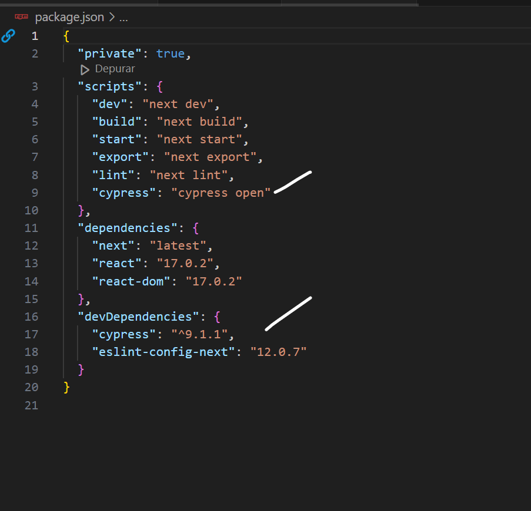

Example of nextjs project using Cypress.io

<!---Start place for the badge -->

<!---End place for the badge -->

# Projecte: Millores amb GitHub Actions en Next.js

### Introducció a GitHub Actions

GitHub Actions és una plataforma d'integració contínua i desplegament contínu (CI/CD) que permet automatitzar fluxos de treball directament en els repositoris de GitHub. Gràcies a GitHub Actions, podem configurar processos que s'executen en resposta a esdeveniments com commits, pushes o creació de pull requests. Al nostre projecte anem a realitzar les seguents tasques:

1. Executar linter per a assegurar la qualitat del codi
El linter analitza automàticament el codi del projecte per assegurar que compleix amb els estàndards de qualitat i estil predefinits, detectant errors comuns com variables no utilitzades o funcions mal escrites. Aquesta tasca garanteix que el codi sigui més llegible i coherent, evitant problemes futurs durant el desenvolupament.

2. Llançar tests automàtics amb Cypress
Els tests amb Cypress simulen la interacció d'un usuari amb l'aplicació, comprovant que les funcionalitats implementades responen correctament. Això redueix la necessitat de tests manuals, assegurant que no s'introdueixen errors ni regressions en les funcionalitats existents, millorant la confiança en el codi.

3. Desplegar aplicacions a plataformes com Vercel
Mitjançant l'ús de Vercel, l'aplicació es desplega automàticament després de cada canvi, fent que estigui disponible en una URL pública. Això permet als desenvolupadors i usuaris finals comprovar ràpidament l'estat del projecte i visualitzar els últims canvis sense passos manuals complicats.

4. Afegir badges al Readme per mostrar l'estat del projecte
Els badges són icones que es mostren al fitxer Readme del projecte i que indiquen l'estat dels workflows, com ara si els tests han estat superats o si el linter no ha trobat errors. Això facilita la visualització ràpida de l'estat del projecte, millorant la transparència i la comunicació dins l'equip.

5. Enviar notificacions als membres de l'equip
Aquest job s'encarrega d'informar als membres de l'equip sobre l'execució del workflow mitjançant l'enviament d'un correu electrònic amb els resultats detallats de cada tasca. Això garanteix que tots els implicats estiguin al corrent dels canvis i possibles problemes detectats durant l'execució.

# Projecte GitHub Actions

Aquest projecte tracta d'integrar un conjunt de tasques automatitzades utilitzant GitHub Actions per a millorar la qualitat i l'eficiència en el desenvolupament d'una aplicació creada amb el framework Next.js. El workflow creat inclou diverses accions: executar un linter per a assegurar que el codi compleix els estàndards de qualitat, llançar tests automàtics amb Cypress per a verificar el funcionament correcte de l'aplicació, desplegar l'aplicació en la plataforma Vercel per a fer-la accessible públicament, i afegir badges al fitxer Readme per a mostrar l'estat del projecte. Finalment, també s'envien notificacions automàtiques als membres de l'equip amb els resultats de l'execució de totes les tasques. L'objectiu principal és implementar bones pràctiques de desenvolupament, reduir errors manuals i garantir un flux de treball més transparent i eficient.

## Instruccions

### 1. Inicialització del Projecte a GitHub

1. Crea un nou projecte a GitHub.
2. Clona el repositori a la teva màquina local.
3. Afegim el contingut del projecte a descarregar al nostre repositori

git add . ,

git commit -m "commit inicial",

git push -u origin main,

Ara ja tenim el nostre repositori actualitzat amb el projecte que hi havia que descarregar

---

### 2. Crear workflow githubActions

1. Creem la carpeta .github/workflows i dins el arxiu main_workflow.js

### 3. AFEGIR LINTER

1. Afegim el job linter al nostre main_workflow

2. Al fer push i arrancar el linter ens apareixeran una serie de errors que haurem de corregir... cambiaar var per let, arreglar les '', cambiar un default que esta mal colocat.

3. Solucionem els errors als arxius que indica y tornem a fer push

- Comprovem la action en github, avore si funciona.

---

### 4. AFEGIR CYPRESS

1. Afegim el job del cypress al nostre main_workflow.

2. Instalem cypress: npm install cypress --save-dev

3. Afegim script de cypress

-Fem push i observem si funciona la action

### 4. AFEGIR BADGEJOB

1. Afegim el job al main_workflow

2. Afegim el badge al readme

3. Fem push als canvis y comprovem si ha funcionat, el nostre readme deuria de haver canviat.

### 5.DEPLOY JOB

1. Instalarem vercel al nostre projecte amb el comando: npm install -g vercel

2. Accedirem a vercel-profile-settings-token y crearem el token

3. Afegim el token als secrets de gitHub. El de idProject y idOrg no es necesari, sols el token de vercel

4. Afegim tarea en main_workflow

5. Pujem els canvis y comprobem si funciona.

### 7.NOTIFICACIÖ TELEGRAMM

1. Acudim a telegram y botFather y creem  bot con /newbot, al crearse donara el TOKEN_TELEGRAM

2. Accedemos al telegram bot raw e iniciamos start para averiguar el CHATID que es el param que nos permitira recibir notificaciones en nuestro bot. 

3. Añadimos las credenciales del token de telegram en Github como hemos hecho anteriormente.

4. Crear el script a .github/actions/Telegram-action.js
- Creem action.yml 
- Creem el package.json amb les dependencies
- Creem el index.js aon afegirem el que volem enviar per notificació
- Fem npm install per a crear el package-lock.json
- Fem npm run build per a crear la carpeta .dist y index.js automaticament

5. Si fem push als canvis y anem a actions.. En teoria tot deuria ixir be y rebre la notificació al nostre bot

En principi aplega el sms, sols que el missatge no s' actualitza. He estat fen recerca avore si podia arreglar-ho pero no hi ha manera.

Si ianem a les nostres actions podrem comprovar tot el procés.

